<!-- ─────────────  HERO  ───────────── -->
<picture>
  <source media="(prefers-color-scheme: dark)"  srcset="./assets/alex-banner.svg">
  <source media="(prefers-color-scheme: light)" srcset="./assets/alex-banner-light.svg">
  
</picture>

 

<!-- ─────────────  01 · SELECTED SYSTEMS  ───────────── -->

<table>
<tr>
<td width="30%" valign="top" align="center">

</td>
<td width="70%" valign="top">

| System | Focus | Stack |
| :--- | :--- | :--- |
| **[homelab](https://github.com/arn0ld87/homelab)** | Infrastruktur-Specs und Runbooks, bevor auf den Maschinen etwas passiert | `Markdown` `HTML` `Tailscale` `Prometheus` |
| **[agora](https://github.com/arn0ld87/agora)** | Self-hosted GraphRAG-Pipeline mit Persona-Agenten, ohne Cloud-API | `Python` `Neo4j` `Ollama` `Vue 3` `Docker` |
| **[harness-qwen](https://github.com/arn0ld87/harness-qwen)** | Lokales Agent-Harness mit deterministischer Tool-Absicherung | `Python` `Local LLM` |
| **[Chappe](https://github.com/arn0ld87/Chappe)** | Signal-Backups durchsuchbar machen — offline, ohne Abhängigkeiten | `Python` `SQLite FTS5` |
| **[skills-public-archive](https://github.com/arn0ld87/skills-public-archive)** | Öffentliches Archiv lokaler Agent-Skills mit Ordner- und ZIP-Export | `Python` `Automation` |
| **[alexle135.de](https://github.com/arn0ld87/alexle135.de)** | Portfolio- und Blogplattform hinter [alexle135.de](https://www.alexle135.de), SSR auf eigenem Server | `TypeScript` `Astro` `Node 22` |

 

> Kuratiert nach Infrastruktur, Automatisierung und Selfhosting — nicht nach Sternen.
> Alle weiteren Repositories: **[github.com/arn0ld87?tab=repositories](https://github.com/arn0ld87?tab=repositories)**

</td>
</tr>
</table>

 

<!-- ─────────────  02 · TOOLCHAIN  ───────────── -->

**INFRASTRUCTURE**

 

**NETWORKING**

 

**AUTOMATION &amp; DEVOPS**

 

**WEB &amp; SERVICES**

 

**AI / EXPERIMENTAL**

 

<!-- ─────────────  03 · ENGINEERING PRINCIPLES  ───────────── -->

 

<!-- ─────────────  04 · CURRENT OPERATIONS  ───────────── -->

 

<!-- ─────────────  05 · TELEMETRY  ───────────── -->

<!-- github-readme-stats.vercel.app liefert dauerhaft 503, github-readme-activity-graph 402.
     Ersetzt durch github-profile-summary-cards (Theme github_dark = #0d1117, deckungsgleich
     mit dem Panel-Grund dieses Profils) und den Snake weiter unten als Contribution-Visual. -->

  

  

  

  

**ENGINEERING METRICS**

  

<!-- Wird vom Workflow .github/workflows/snake.yml in den Branch `output` gerendert -->
<picture>
  <source media="(prefers-color-scheme: dark)"  srcset="https://raw.githubusercontent.com/arn0ld87/arn0ld87/output/snake-dark.svg">
  <source media="(prefers-color-scheme: light)" srcset="https://raw.githubusercontent.com/arn0ld87/arn0ld87/output/snake-light.svg">
  
</picture>

 

<!-- ─────────────  06 · ESTABLISH CONNECTION  ───────────── -->

  

<code>Leipzig, DE</code> &nbsp;·&nbsp; <code>Fachinformatiker für Systemintegration</code> &nbsp;·&nbsp; <code>offen für Infrastructure- und DevOps-Themen</code>

 

<!-- ─────────────  FOOTER  ───────────── -->

